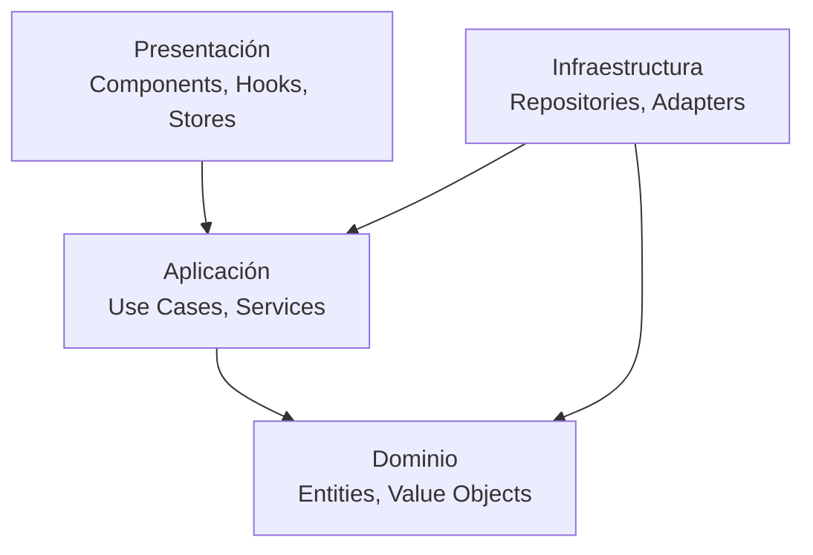

# Ordenadores de Umbral

> **Sistema de Aprendizaje Interactivo de Principios de Software**

Un juego educativo que enseña principios de desarrollo de software a través de una narrativa inmersiva con estética retro/terminal. Los jugadores aprenden conceptos como principios SOLID, arquitectura limpia y mejores prácticas mientras toman decisiones que afectan su progreso en el juego.


## 🎯 Características Principales

### 🎮 Experiencia de Juego

- **Interfaz de terminal retro** con efectos CRT auténticos
- **Narrativa ramificada** donde las decisiones afectan el progreso
- **Sistema de estadísticas** (energía, humor, tiempo, errores)
- **Progresión por niveles** con contenido educativo estructurado
- **Sistema de logros** para reconocer el aprendizaje

### 📚 Contenido Educativo

- **Principios SOLID** explicados de forma interactiva
- **Arquitectura de software** con ejemplos prácticos
- **Patrones de diseño** implementados en el juego
- **Mejores prácticas** de desarrollo demostradas
- **Pensamiento crítico** sobre diseño de software

### 🏗️ Arquitectura Técnica

- **Arquitectura hexagonal** con separación de capas
- **Módulos independientes** por dominio de negocio
- **Principios de arquitectura limpia** aplicados
- **Testing exhaustivo** con alta cobertura
- **Documentación automatizada** de APIs

## 🚀 Inicio Rápido

### Prerrequisitos

- Node.js 18+
- npm o yarn
- Git

### Instalación

```bash
# Clonar el repositorio
git clone https://github.com/tu-usuario/ordenadores-de-umbral.git
cd ordenadores-de-umbral

# Instalar dependencias
npm install

# Ejecutar en modo desarrollo
npm run dev
```

Abre [http://localhost:3000](http://localhost:3000) en tu navegador para ver el juego.

### Scripts Disponibles

```bash
npm run dev      # Servidor de desarrollo
npm run build    # Construir para producción
npm run start    # Servidor de producción
npm run lint     # Linter de código
npm run test     # Ejecutar pruebas
npm run test:coverage # Cobertura de pruebas
```

## 🎮 Cómo Jugar

1. **Navega con el teclado**: Usa las flechas ↑ ↓ para moverte entre opciones
2. **Selecciona con Enter**: Confirma tus decisiones
3. **Presiona ESC**: Para volver al menú principal
4. **Lee cuidadosamente**: Cada decisión afecta tu progreso y estadísticas
5. **Aprende jugando**: Los conceptos se explican a través de la narrativa

### Controles

| Tecla | Acción |
|-------|--------|
| ↑ ↓ | Navegar entre opciones |
| Enter | Seleccionar opción |
| ESC | Volver al menú principal |
| Tab | Navegación accesible |

## 🏗️ Arquitectura del Proyecto

### Estructura de Directorios

```
ordenadores-de-umbral/
├── app/                    # Next.js App Router
│   ├── (game)/            # Rutas del juego
│   ├── globals.css        # Estilos globales
│   └── layout.tsx         # Layout principal
├── modules/               # Módulos de dominio
│   ├── game/             # Lógica del juego
│   ├── player/           # Gestión del jugador
│   ├── scenes/           # Sistema de escenas
│   └── navigation/       # Navegación
├── components/           # Componentes React
│   ├── game/            # Componentes del juego
│   ├── ui/              # Componentes UI reutilizables
│   └── layout/          # Componentes de layout
├── lib/                 # Utilidades y configuración
├── data/               # Datos del juego
├── docs/               # Documentación
├── .kiro/              # Configuración de Kiro IDE
│   ├── specs/          # Especificaciones de desarrollo
│   ├── steering/       # Guías de desarrollo
│   └── hooks/          # Automatización con IA
└── tests/              # Pruebas organizadas
```

### Capas de Arquitectura



## 🛠️ Stack Tecnológico

### Frontend

- **[Next.js 15](https://nextjs.org/)** - Framework React con App Router
- **[TypeScript](https://www.typescriptlang.org/)** - Tipado estático
- **[Tailwind CSS](https://tailwindcss.com/)** - Estilos utilitarios
- **[Framer Motion](https://www.framer.com/motion/)** - Animaciones

### Estado y Datos

- **[Zustand](https://zustand-demo.pmnd.rs/)** - Gestión de estado
- **[Immer](https://immerjs.github.io/immer/)** - Actualizaciones inmutables

### UI Components

- **[Radix UI](https://www.radix-ui.com/)** - Componentes accesibles
- **[Lucide React](https://lucide.dev/)** - Iconos

### Testing

- **[Jest](https://jestjs.io/)** - Framework de testing
- **[Testing Library](https://testing-library.com/)** - Testing de componentes
- **[Playwright](https://playwright.dev/)** - Testing E2E

### Desarrollo

- **[ESLint](https://eslint.org/)** - Linting de código
- **[Prettier](https://prettier.io/)** - Formateo de código
- **[TypeDoc](https://typedoc.org/)** - Documentación automática

## 🧪 Testing

El proyecto mantiene alta cobertura de pruebas con diferentes tipos:

### Ejecutar Pruebas

```bash
# Todas las pruebas
npm run test

# Pruebas con cobertura
npm run test:coverage

# Pruebas en modo watch
npm run test:watch

# Pruebas E2E
npm run test:e2e
```

### Cobertura Objetivo

- **Dominio**: 95%+ (lógica crítica de negocio)
- **Aplicación**: 90%+ (casos de uso)
- **Presentación**: 80%+ (componentes principales)

## 📚 Documentación

### Para Desarrolladores

- **[Guía de Arquitectura](docs/PROJECT_OVERVIEW.md)** - Visión general del proyecto
- **[Especificación de Refactorización](.kiro/specs/refactorizacion-arquitectura-modular/)** - Plan de mejoras
- **[Principios de Arquitectura Limpia](.kiro/steering/arquitectura-limpia.md)** - Guías de desarrollo
- **[Mejores Prácticas React](.kiro/steering/mejores-practicas-react.md)** - Estándares de componentes

### Para Usuarios

- **[Cómo Jugar](#-cómo-jugar)** - Guía básica de uso
- **[Controles](#controles)** - Referencia de teclado
- **Contenido Educativo** - Explicaciones de conceptos

## 🤖 Automatización con IA

El proyecto incluye hooks de IA para automatizar tareas de desarrollo:

### Hooks Disponibles

- **🏗️ Crear Módulo** - Genera estructura completa de módulos
- **⚡ Crear Caso de Uso** - Crea casos de uso con pruebas
- **🎯 Crear Entidad** - Genera entidades de dominio
- **🔄 Migrar Componente** - Migra componentes legacy
- **🚀 Optimizar Rendimiento** - Analiza y optimiza componentes
- **♿ Revisar Accesibilidad** - Audita accesibilidad
- **📊 Progreso Refactorización** - Monitorea progreso
- **🧪 Generar Pruebas** - Crea pruebas automáticamente

## 🎨 Diseño y UX

### Tema Visual

- **Estética retro/terminal** inspirada en computadoras vintage
- **Paleta de colores** verde fosforescente sobre fondo negro
- **Tipografía monoespaciada** para autenticidad
- **Efectos CRT** con ruido y resplandor
- **Animaciones suaves** que no distraen del contenido

### Accesibilidad

- **Navegación por teclado** completa
- **Soporte para lectores de pantalla** con ARIA
- **Contraste alto** cumpliendo WCAG 2.1 AA
- **Responsive design** para diferentes dispositivos
- **Reducción de movimiento** respetando preferencias del usuario

## 🚧 Roadmap

### v1.1 - Próximas Características

- [ ] Más niveles educativos (patrones de diseño, testing)
- [ ] Sistema de guardado en la nube
- [ ] Modo multijugador colaborativo
- [ ] Editor de escenas personalizado
- [ ] Métricas de aprendizaje avanzadas

### v1.2 - Expansiones

- [ ] Soporte multiidioma
- [ ] Temas visuales alternativos
- [ ] API para contenido externo
- [ ] Integración con LMS educativos
- [ ] Certificaciones de completitud

## 🤝 Contribuir

¡Las contribuciones son bienvenidas! Por favor lee nuestra [guía de contribución](CONTRIBUTING.md) antes de enviar cambios.

### Proceso de Desarrollo

1. Fork el repositorio
2. Crea una rama para tu feature (`git checkout -b feature/nueva-caracteristica`)
3. Sigue las guías de arquitectura limpia en `.kiro/steering/`
4. Añade pruebas para tu código
5. Ejecuta las pruebas (`npm test`)
6. Commit tus cambios (`git commit -m 'feat: añadir nueva característica'`)
7. Push a la rama (`git push origin feature/nueva-caracteristica`)
8. Abre un Pull Request

### Convenciones

- **Commits**: Seguir [Conventional Commits](https://www.conventionalcommits.org/)
- **Código**: Inglés para variables, español para documentación
- **Testing**: Cobertura mínima del 80%
- **Arquitectura**: Respetar principios de arquitectura limpia

## 📄 Licencia

Este proyecto está licenciado bajo la Licencia MIT - ver el archivo [LICENSE](LICENSE) para detalles.

## 👥 Equipo

- **Desarrollador Principal** - [Tu Nombre](https://github.com/tu-usuario)
- **Arquitectura** - Diseño de sistema modular y escalable
- **UX/UI** - Experiencia de usuario retro auténtica
- **Contenido Educativo** - Narrativa y conceptos técnicos

## 🙏 Agradecimientos

- Inspirado en juegos educativos clásicos de programación
- Comunidad de desarrolladores que valoran la arquitectura limpia
- Educadores que buscan herramientas interactivas de enseñanza
- Contribuidores que ayudan a mejorar el proyecto

## 📞 Soporte

- **Issues**: [GitHub Issues](https://github.com/tu-usuario/ordenadores-de-umbral/issues)
- **Discusiones**: [GitHub Discussions](https://github.com/tu-usuario/ordenadores-de-umbral/discussions)
- **Email**: <soporte@ordenadores-de-umbral.com>

---

**¿Listo para aprender programación de una forma completamente nueva?** 🚀

[Jugar Ahora](https://ordenadores-de-umbral.vercel.app) | [Ver Demo](https://demo.ordenadores-de-umbral.com) | [Documentación](docs/)
