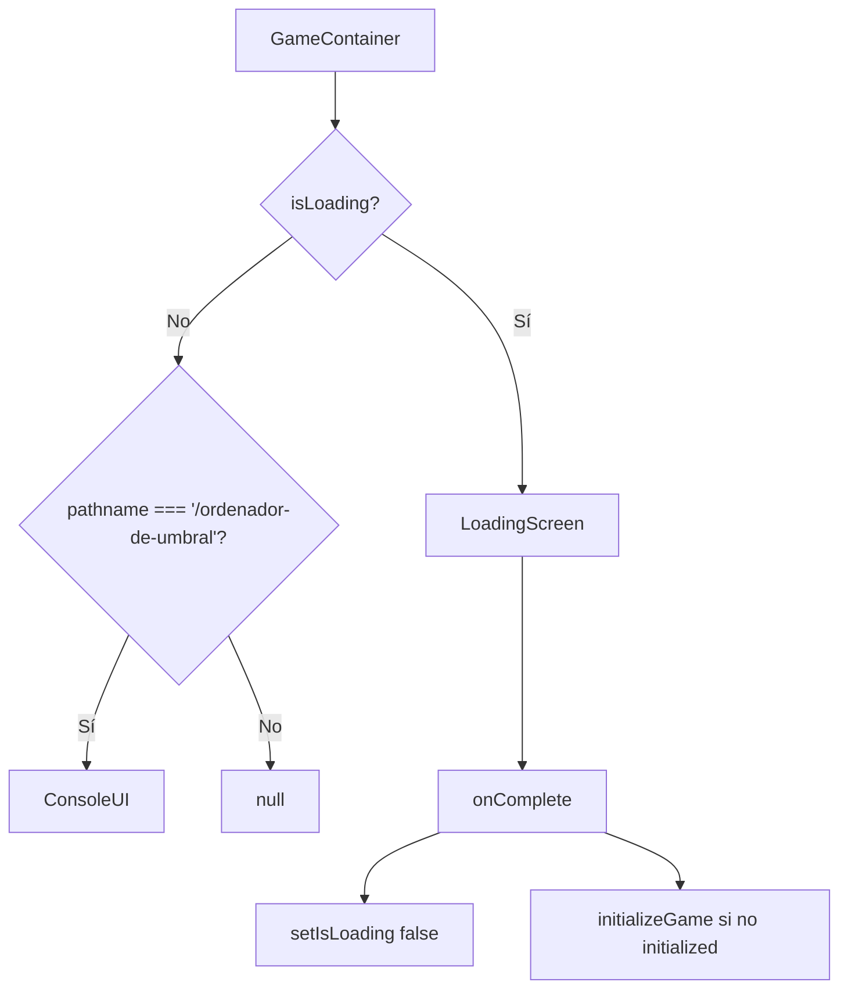
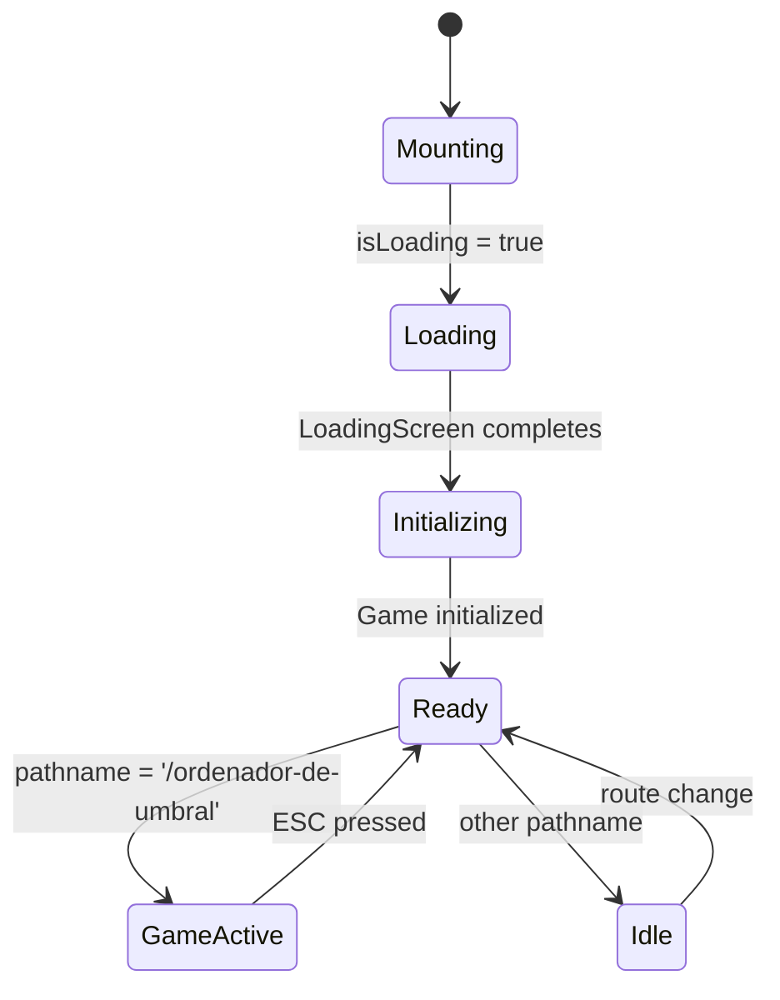

# GameContainer

El componente `GameContainer` es el contenedor principal del juego que coordina todas las partes del sistema y maneja la navegación entre diferentes estados.

## Definición

```typescript
/**
 * Contenedor principal del juego que coordina las diferentes partes del juego
 * y maneja la navegación entre estados.
 * 
 * @example
 * ```tsx
 * <GameContainer />
 * ```
 */
export default function GameContainer(): JSX.Element
```

## Descripción

`GameContainer` actúa como el coordinador principal del juego, responsable de:

- Inicializar el estado del juego
- Manejar la navegación por teclado global
- Coordinar la carga de componentes
- Gestionar transiciones entre diferentes pantallas
- Proporcionar el contexto necesario para los componentes hijos

## Props

Este componente no recibe props, ya que obtiene todo su estado del store global del juego.

## Estado Interno

```typescript
interface GameContainerState {
  isLoading: boolean;
  gameContainerRef: RefObject<HTMLDivElement>;
}
```

### isLoading: boolean
- **Descripción**: Indica si el juego está en proceso de carga inicial
- **Valor inicial**: `true`
- **Se actualiza**: Cuando la pantalla de carga completa su animación

### gameContainerRef: RefObject<HTMLDivElement>
- **Descripción**: Referencia al elemento DOM principal para manejo de foco
- **Uso**: Garantizar que el contenedor tenga foco para navegación por teclado

## Hooks Utilizados

### useGameStore
```typescript
const initialized = useGameStore((state) => state.initialized);
const initializeGame = useGameStore((state) => state.initializeGame);
const showMainMenu = useGameStore((state) => state.showMainMenu);
const toggleMainMenu = useGameStore((state) => state.toggleMainMenu);
const currentScene = useGameStore((state) => state.currentScene);
```

### useRouter y usePathname
```typescript
const router = useRouter();
const pathname = usePathname();
```

## Efectos

### Inicialización del Juego
```typescript
useEffect(() => {
  if (!initialized) {
    initializeGame();
  }
}, [initializeGame, initialized]);
```

### Manejo de Teclado Global
```typescript
useEffect(() => {
  const handleKeyDown = (e: KeyboardEvent) => {
    if (e.key === "Escape") {
      if (pathname === '/ordenador-de-umbral') {
        router.push('/');
      } else {
        toggleMainMenu();
      }
    }
  };

  window.addEventListener("keydown", handleKeyDown);
  return () => window.removeEventListener("keydown", handleKeyDown);
}, [toggleMainMenu, pathname, router]);
```

### Manejo de Foco
```typescript
useEffect(() => {
  if (gameContainerRef.current) {
    gameContainerRef.current.focus();
  }
}, []);
```

## Lógica de Renderizado

El componente utiliza renderizado condicional basado en el estado actual:



### Pantalla de Carga
```typescript
if (isLoading) {
  return (
    <LoadingScreen onComplete={() => {
      setIsLoading(false);
      if (!initialized) {
        initializeGame();
      }
    }} />
  );
}
```

### Interfaz del Juego
```typescript
if (pathname === '/ordenador-de-umbral') {
  return <ConsoleUI />;
}
```

## Componentes Hijos

### LoadingScreen
- **Propósito**: Mostrar animación de carga inicial
- **Props**: `onComplete` - Callback cuando la carga termina
- **Duración**: Configurable, por defecto 2-3 segundos

### ConsoleUI
- **Propósito**: Interfaz principal del terminal del juego
- **Renderizado**: Solo en la ruta `/ordenador-de-umbral`
- **Estado**: Obtiene datos del store global

## Navegación

### Teclas de Navegación

| Tecla | Acción | Contexto |
|-------|--------|----------|
| `Escape` | Volver al menú principal | Ruta `/ordenador-de-umbral` |
| `Escape` | Toggle menú principal | Otras rutas |

### Rutas Manejadas

- **`/ordenador-de-umbral`**: Muestra la interfaz del juego
- **Otras rutas**: No renderiza contenido (manejado por otros componentes)

## Ejemplo de Uso

### Uso Básico
```tsx
import GameContainer from '@/components/game/game-container';

export default function GamePage() {
  return (
    <div className="min-h-screen">
      <GameContainer />
    </div>
  );
}
```

### Con Layout Personalizado
```tsx
import GameContainer from '@/components/game/game-container';
import GameLayout from '@/components/layout/game-layout';

export default function GamePage() {
  return (
    <GameLayout>
      <GameContainer />
    </GameLayout>
  );
}
```

## Estados del Componente



## Eventos

### Eventos Emitidos

El componente no emite eventos personalizados, pero responde a:

- **Eventos de teclado**: `keydown` para navegación
- **Eventos de ruta**: Cambios en `pathname`
- **Eventos del store**: Cambios en el estado del juego

### Eventos Manejados

```typescript
interface GameContainerEvents {
  onGameInitialized: () => void;
  onLoadingComplete: () => void;
  onNavigationChange: (pathname: string) => void;
  onEscapePressed: () => void;
}
```

## Performance

### Optimizaciones

1. **Importación Dinámica**: `GameContent` se carga solo cuando es necesario
2. **Memoización**: Estado del store se selecciona de forma granular
3. **Event Listeners**: Se limpian correctamente en `useEffect`

### Lazy Loading
```typescript
const GameContent = dynamic(() => import("./ui/GameContent"), {
  loading: () => (
    <div className="flex items-center justify-center h-64">
      <p className="text-teal-400">Cargando experiencia...</p>
    </div>
  ),
  ssr: false,
});
```

## Testing

### Casos de Prueba

```typescript
describe('GameContainer', () => {
  beforeEach(() => {
    // Reset game store
    useGameStore.getState().resetGame();
  });

  it('should show loading screen initially', () => {
    render(<GameContainer />);
    
    expect(screen.getByText(/cargando/i)).toBeInTheDocument();
  });

  it('should initialize game after loading', async () => {
    render(<GameContainer />);
    
    await waitFor(() => {
      expect(useGameStore.getState().initialized).toBe(true);
    });
  });

  it('should handle escape key navigation', async () => {
    const mockPush = jest.fn();
    (useRouter as jest.Mock).mockReturnValue({ push: mockPush });
    
    render(<GameContainer />);
    
    fireEvent.keyDown(window, { key: 'Escape' });
    
    expect(mockPush).toHaveBeenCalledWith('/');
  });

  it('should render ConsoleUI on game route', () => {
    (usePathname as jest.Mock).mockReturnValue('/ordenador-de-umbral');
    
    render(<GameContainer />);
    
    expect(screen.getByRole('main')).toBeInTheDocument();
  });
});
```

### Mocks Necesarios

```typescript
// __mocks__/next/navigation.ts
export const useRouter = jest.fn(() => ({
  push: jest.fn(),
  back: jest.fn(),
}));

export const usePathname = jest.fn(() => '/');

// __mocks__/zustand.ts
export const useGameStore = jest.fn();
```

## Accesibilidad

### Características de Accesibilidad

- **Foco del Teclado**: El contenedor recibe foco automáticamente
- **Navegación por Teclado**: Soporte completo para navegación sin mouse
- **Lectores de Pantalla**: Estructura semántica apropiada
- **Contraste**: Cumple con estándares WCAG 2.1 AA

### Atributos ARIA

```typescript
<div 
  ref={gameContainerRef}
  role="application"
  aria-label="Ordenadores de Umbral - Juego Educativo"
  tabIndex={0}
  className="game-container"
>
  {/* Contenido del juego */}
</div>
```

## Troubleshooting

### Problemas Comunes

1. **El juego no se inicializa**
   - Verificar que el store esté correctamente configurado
   - Comprobar que `initializeGame()` se ejecute

2. **La navegación por teclado no funciona**
   - Verificar que el contenedor tenga foco
   - Comprobar que los event listeners estén registrados

3. **La pantalla de carga no desaparece**
   - Verificar que `onComplete` se ejecute correctamente
   - Comprobar el estado de `isLoading`

### Debug

```typescript
// Añadir logs para debugging
useEffect(() => {
  console.log('GameContainer state:', {
    initialized,
    isLoading,
    pathname,
    showMainMenu
  });
}, [initialized, isLoading, pathname, showMainMenu]);
```