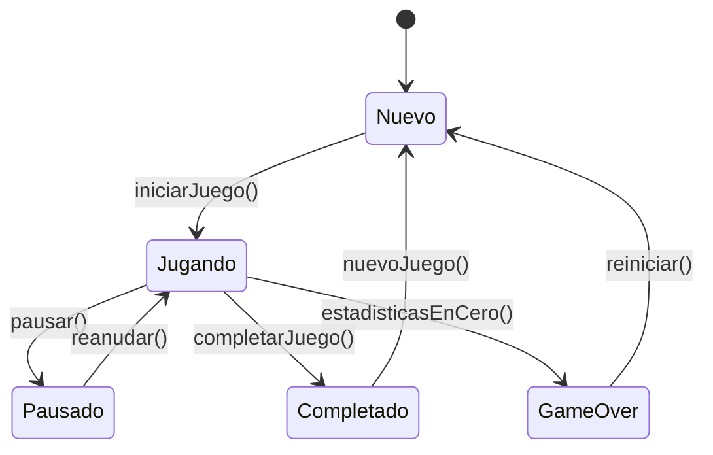
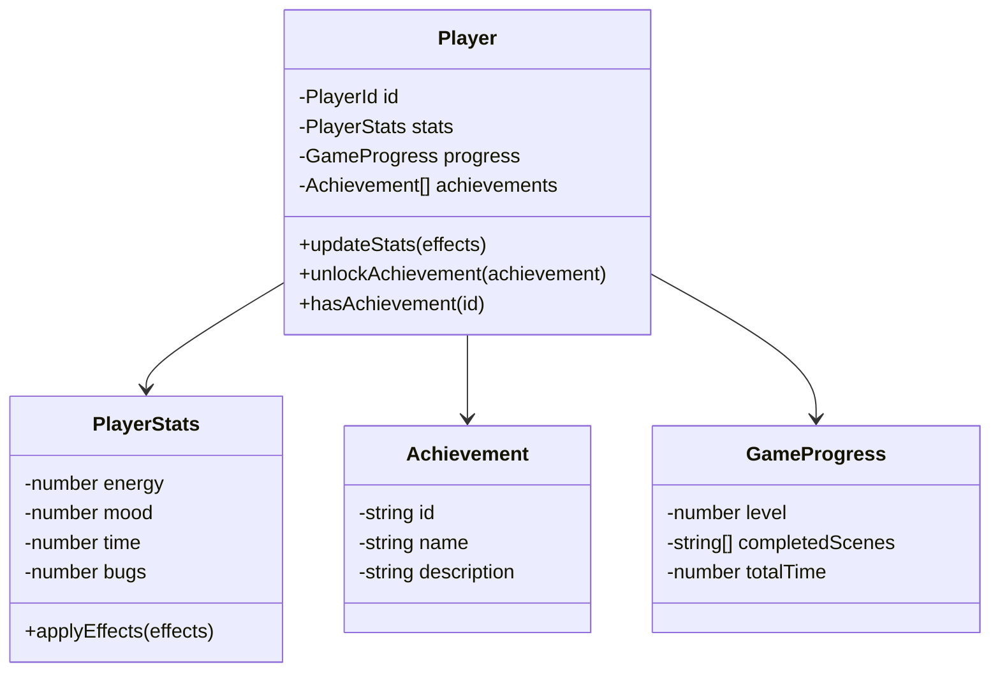

# Entidad Player

La entidad `Player` representa al jugador en el sistema, encapsulando sus estadísticas, progreso y estado actual en el juego.

## Definición

```typescript
/**
 * Entidad que representa al jugador del juego
 * Contiene las estadísticas principales y el progreso
 */
export class Player {
  constructor(
    private readonly id: PlayerId,
    private stats: PlayerStats,
    private progress: GameProgress,
    private achievements: Achievement[]
  ) {}

  /**
   * Actualiza las estadísticas del jugador aplicando efectos
   * @param effects - Efectos a aplicar sobre las estadísticas
   */
  public updateStats(effects: StatEffects): void {
    this.stats = this.stats.applyEffects(effects);
  }

  /**
   * Desbloquea un nuevo logro para el jugador
   * @param achievement - Logro a desbloquear
   */
  public unlockAchievement(achievement: Achievement): void {
    if (!this.hasAchievement(achievement.id)) {
      this.achievements.push(achievement);
    }
  }

  /**
   * Verifica si el jugador tiene un logro específico
   * @param achievementId - ID del logro a verificar
   */
  public hasAchievement(achievementId: string): boolean {
    return this.achievements.some(a => a.id === achievementId);
  }

  // Getters
  public getId(): PlayerId { return this.id; }
  public getStats(): PlayerStats { return this.stats; }
  public getProgress(): GameProgress { return this.progress; }
  public getAchievements(): Achievement[] { return [...this.achievements]; }
}
```

## Propiedades

### id: PlayerId
- **Tipo**: `PlayerId` (Value Object)
- **Descripción**: Identificador único del jugador
- **Inmutable**: Sí

### stats: PlayerStats
- **Tipo**: `PlayerStats` (Value Object)
- **Descripción**: Estadísticas actuales del jugador (energía, humor, tiempo, errores)
- **Rango**: Cada estadística entre 0-100
- **Mutable**: Sí, a través de `updateStats()`

### progress: GameProgress
- **Tipo**: `GameProgress` (Value Object)
- **Descripción**: Progreso del jugador en el juego
- **Incluye**: Nivel actual, escenas completadas, tiempo total jugado

### achievements: Achievement[]
- **Tipo**: Array de `Achievement`
- **Descripción**: Lista de logros desbloqueados por el jugador
- **Mutable**: Sí, a través de `unlockAchievement()`

## Métodos Principales

### updateStats(effects: StatEffects): void

Actualiza las estadísticas del jugador aplicando los efectos especificados.

**Parámetros:**
- `effects`: Objeto con los cambios a aplicar en cada estadística

**Ejemplo:**
```typescript
const player = new Player(playerId, initialStats, progress, []);

// Aplicar efectos de una elección
player.updateStats({
  energy: -10,  // Reduce energía en 10
  mood: 5,      // Aumenta humor en 5
  time: 15      // Aumenta tiempo en 15
});
```

**Reglas de Negocio:**
- Las estadísticas se mantienen en el rango 0-100
- Los efectos se acumulan con los valores actuales
- Si una estadística llega a 0, puede activar eventos especiales

### unlockAchievement(achievement: Achievement): void

Desbloquea un nuevo logro para el jugador si no lo tiene ya.

**Parámetros:**
- `achievement`: El logro a desbloquear

**Ejemplo:**
```typescript
const achievement = new Achievement(
  'first-choice',
  'Primera Decisión',
  'Tomaste tu primera decisión en el juego'
);

player.unlockAchievement(achievement);
```

## Invariantes

1. **ID Único**: El ID del jugador debe ser único y no puede cambiar
2. **Estadísticas Válidas**: Todas las estadísticas deben estar entre 0 y 100
3. **Logros Únicos**: No se pueden tener logros duplicados
4. **Progreso Consistente**: El progreso debe ser coherente con las acciones realizadas

## Estados del Jugador



## Eventos de Dominio

La entidad Player puede generar los siguientes eventos:

### PlayerStatsUpdated
```typescript
interface PlayerStatsUpdatedEvent {
  playerId: PlayerId;
  previousStats: PlayerStats;
  newStats: PlayerStats;
  effects: StatEffects;
  timestamp: Date;
}
```

### AchievementUnlocked
```typescript
interface AchievementUnlockedEvent {
  playerId: PlayerId;
  achievement: Achievement;
  timestamp: Date;
}
```

### PlayerLevelUp
```typescript
interface PlayerLevelUpEvent {
  playerId: PlayerId;
  previousLevel: number;
  newLevel: number;
  timestamp: Date;
}
```

## Ejemplo de Uso Completo

```typescript
// Crear un nuevo jugador
const playerId = PlayerId.create();
const initialStats = PlayerStats.create({
  energy: 50,
  mood: 50,
  time: 0,
  bugs: 0
});
const progress = GameProgress.initial();

const player = new Player(playerId, initialStats, progress, []);

// Simular una elección del jugador
const choiceEffects = StatEffects.create({
  energy: -10,
  mood: 5,
  time: 15
});

player.updateStats(choiceEffects);

// Verificar si se debe desbloquear un logro
if (player.getStats().getTime() >= 60) {
  const timeAchievement = new Achievement(
    'time-master',
    'Maestro del Tiempo',
    'Jugaste durante más de 60 minutos'
  );
  player.unlockAchievement(timeAchievement);
}

console.log('Estadísticas actuales:', player.getStats().toJSON());
console.log('Logros:', player.getAchievements().map(a => a.name));
```

## Testing

### Casos de Prueba Principales

```typescript
describe('Player Entity', () => {
  it('should update stats correctly', () => {
    const player = createTestPlayer();
    const effects = StatEffects.create({ energy: -10, mood: 5 });
    
    player.updateStats(effects);
    
    expect(player.getStats().getEnergy()).toBe(40);
    expect(player.getStats().getMood()).toBe(55);
  });

  it('should not allow duplicate achievements', () => {
    const player = createTestPlayer();
    const achievement = createTestAchievement();
    
    player.unlockAchievement(achievement);
    player.unlockAchievement(achievement); // Intentar duplicar
    
    expect(player.getAchievements()).toHaveLength(1);
  });

  it('should clamp stats to valid range', () => {
    const player = createTestPlayer();
    const effects = StatEffects.create({ energy: -100 });
    
    player.updateStats(effects);
    
    expect(player.getStats().getEnergy()).toBe(0);
  });
});
```

## Relaciones

