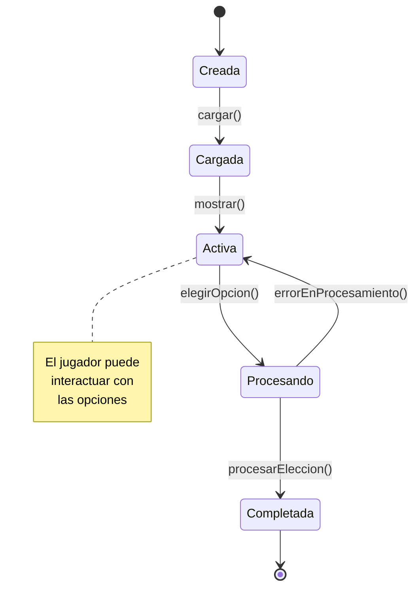
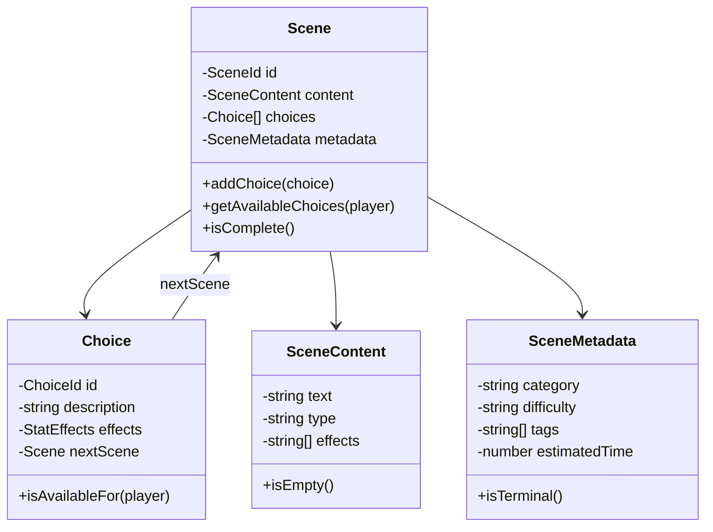

# Entidad Scene

La entidad `Scene` representa una escena del juego, conteniendo el contenido narrativo y las opciones disponibles para el jugador.

## Definición

```typescript
/**
 * Entidad que representa una escena del juego
 * Contiene el contenido narrativo y las opciones de interacción
 */
export class Scene {
  constructor(
    private readonly id: SceneId,
    private content: SceneContent,
    private choices: Choice[],
    private metadata: SceneMetadata
  ) {}

  /**
   * Añade una nueva opción a la escena
   * @param choice - Opción a añadir
   */
  public addChoice(choice: Choice): void {
    if (!this.hasChoice(choice.getId())) {
      this.choices.push(choice);
    }
  }

  /**
   * Verifica si la escena tiene una opción específica
   * @param choiceId - ID de la opción a verificar
   */
  public hasChoice(choiceId: string): boolean {
    return this.choices.some(c => c.getId() === choiceId);
  }

  /**
   * Obtiene las opciones disponibles para el jugador actual
   * @param player - Jugador para filtrar opciones
   */
  public getAvailableChoices(player: Player): Choice[] {
    return this.choices.filter(choice => choice.isAvailableFor(player));
  }

  /**
   * Verifica si la escena está completa (sin opciones disponibles)
   */
  public isComplete(): boolean {
    return this.choices.length === 0;
  }

  // Getters
  public getId(): SceneId { return this.id; }
  public getContent(): SceneContent { return this.content; }
  public getChoices(): Choice[] { return [...this.choices]; }
  public getMetadata(): SceneMetadata { return this.metadata; }
}
```

## Propiedades

### id: SceneId
- **Tipo**: `SceneId` (Value Object)
- **Descripción**: Identificador único de la escena
- **Formato**: String alfanumérico (ej: "intro", "solid-1", "philosophy-deep")
- **Inmutable**: Sí

### content: SceneContent
- **Tipo**: `SceneContent` (Value Object)
- **Descripción**: Contenido textual de la escena
- **Incluye**: Texto principal, efectos de escritura, metadatos de formato
- **Mutable**: Sí, para escenas dinámicas

### choices: Choice[]
- **Tipo**: Array de `Choice`
- **Descripción**: Opciones disponibles para el jugador en esta escena
- **Puede estar vacío**: Sí (escenas finales o de transición)
- **Mutable**: Sí, a través de `addChoice()`

### metadata: SceneMetadata
- **Tipo**: `SceneMetadata` (Value Object)
- **Descripción**: Metadatos de la escena (categoría, dificultad, tags)
- **Inmutable**: Sí

## Métodos Principales

### addChoice(choice: Choice): void

Añade una nueva opción a la escena si no existe ya.

**Parámetros:**
- `choice`: La opción a añadir

**Ejemplo:**
```typescript
const scene = new Scene(sceneId, content, [], metadata);

const choice = new Choice(
  ChoiceId.create('learn-solid'),
  'Aprender principios SOLID',
  StatEffects.create({ energy: -5, mood: 10 }),
  nextScene
);

scene.addChoice(choice);
```

### getAvailableChoices(player: Player): Choice[]

Obtiene las opciones disponibles para un jugador específico, aplicando filtros basados en el estado del jugador.

**Parámetros:**
- `player`: El jugador para el cual filtrar las opciones

**Retorna:**
- Array de opciones disponibles

**Ejemplo:**
```typescript
const availableChoices = scene.getAvailableChoices(player);

// Solo mostrar opciones que el jugador puede ejecutar
availableChoices.forEach(choice => {
  console.log(`- ${choice.getDescription()}`);
});
```

## Tipos de Escenas

### Escena Narrativa
Contiene principalmente texto y pocas opciones de navegación.

```typescript
const narrativeScene = new Scene(
  SceneId.create('intro-story'),
  SceneContent.create({
    text: `> Terminal iniciada
> Sistema operativo: GraphOS v1.0.0

Bienvenido al simulador de programación trascendental...`,
    type: 'narrative'
  }),
  [continueChoice],
  SceneMetadata.create({
    category: 'introduction',
    difficulty: 'easy',
    tags: ['story', 'intro']
  })
);
```

### Escena de Decisión
Presenta múltiples opciones que afectan significativamente el progreso.

```typescript
const decisionScene = new Scene(
  SceneId.create('solid-choice'),
  SceneContent.create({
    text: '¿Qué principio SOLID te gustaría explorar primero?',
    type: 'decision'
  }),
  [srpChoice, ocpChoice, lspChoice, ispChoice, dipChoice],
  SceneMetadata.create({
    category: 'education',
    difficulty: 'medium',
    tags: ['solid', 'principles', 'choice']
  })
);
```

### Escena de Evaluación
Presenta desafíos o preguntas para evaluar el conocimiento.

```typescript
const evaluationScene = new Scene(
  SceneId.create('solid-quiz'),
  SceneContent.create({
    text: 'Pregunta: ¿Cuál es el principio de Responsabilidad Única?',
    type: 'evaluation'
  }),
  [correctAnswer, wrongAnswer1, wrongAnswer2],
  SceneMetadata.create({
    category: 'assessment',
    difficulty: 'hard',
    tags: ['quiz', 'solid', 'srp']
  })
);
```

## Estados de la Escena



## Eventos de Dominio

### SceneLoaded
```typescript
interface SceneLoadedEvent {
  sceneId: SceneId;
  playerId: PlayerId;
  timestamp: Date;
  previousScene?: SceneId;
}
```

### ChoiceSelected
```typescript
interface ChoiceSelectedEvent {
  sceneId: SceneId;
  choiceId: string;
  playerId: PlayerId;
  effects: StatEffects;
  timestamp: Date;
}
```

### SceneCompleted
```typescript
interface SceneCompletedEvent {
  sceneId: SceneId;
  playerId: PlayerId;
  completionTime: number;
  choicesMade: string[];
  timestamp: Date;
}
```

## Validaciones

### Reglas de Negocio

1. **ID Único**: Cada escena debe tener un ID único en el sistema
2. **Contenido Válido**: El contenido no puede estar vacío
3. **Opciones Coherentes**: Las opciones deben ser coherentes con el contenido
4. **Metadatos Completos**: Los metadatos deben incluir categoría y dificultad

### Validaciones de Integridad

```typescript
export class SceneValidator {
  static validate(scene: Scene): ValidationResult {
    const errors: string[] = [];

    if (!scene.getId().isValid()) {
      errors.push('ID de escena inválido');
    }

    if (scene.getContent().isEmpty()) {
      errors.push('El contenido de la escena no puede estar vacío');
    }

    if (scene.getChoices().length === 0 && !scene.getMetadata().isTerminal()) {
      errors.push('Las escenas no terminales deben tener al menos una opción');
    }

    return new ValidationResult(errors.length === 0, errors);
  }
}
```

## Ejemplo de Uso Completo

```typescript
// Crear contenido de la escena
const content = SceneContent.create({
  text: `> debugSelf() ejecutado
> Analizando estado interno...

"El código que escribes es un reflejo de tu mente. 
¿Qué dice tu código sobre ti?"

La terminal parpadea mientras procesa tu introspección.`,
  type: 'philosophical',
  effects: ['typewriter', 'glow']
});

// Crear metadatos
const metadata = SceneMetadata.create({
  category: 'philosophy',
  difficulty: 'medium',
  tags: ['introspection', 'self-analysis'],
  estimatedTime: 120
});

// Crear la escena
const scene = new Scene(
  SceneId.create('debug-self'),
  content,
  [],
  metadata
);

// Añadir opciones
const continueChoice = new Choice(
  ChoiceId.create('continue-debug'),
  'Continuar el análisis',
  StatEffects.create({ energy: -10, mood: 15 }),
  nextScene
);

const stopChoice = new Choice(
  ChoiceId.create('stop-debug'),
  'Detener la introspección',
  StatEffects.create({ energy: 5, mood: -5 }),
  previousScene
);

scene.addChoice(continueChoice);
scene.addChoice(stopChoice);

// Usar la escena en el juego
const availableChoices = scene.getAvailableChoices(player);
console.log(`Escena: ${scene.getId()}`);
console.log(`Opciones disponibles: ${availableChoices.length}`);
```

## Testing

### Casos de Prueba Principales

```typescript
describe('Scene Entity', () => {
  it('should create scene with valid content', () => {
    const scene = createTestScene();
    
    expect(scene.getId()).toBeDefined();
    expect(scene.getContent().getText()).not.toBe('');
  });

  it('should add choices without duplicates', () => {
    const scene = createTestScene();
    const choice = createTestChoice();
    
    scene.addChoice(choice);
    scene.addChoice(choice); // Intentar duplicar
    
    expect(scene.getChoices()).toHaveLength(1);
  });

  it('should filter choices based on player state', () => {
    const scene = createTestScene();
    const highEnergyChoice = createChoiceWithRequirement('energy', 80);
    const lowEnergyPlayer = createPlayerWithStats({ energy: 20 });
    
    scene.addChoice(highEnergyChoice);
    
    const available = scene.getAvailableChoices(lowEnergyPlayer);
    expect(available).not.toContain(highEnergyChoice);
  });
});
```

## Relaciones

