# Estado y Stores

Esta sección documenta la gestión del estado global del juego utilizando Zustand y los patrones de estado implementados.

## Arquitectura del Estado

El estado del juego se gestiona mediante un store centralizado que sigue los principios de arquitectura limpia:

```mermaid
graph TB
    A[Componentes React] --> B[Zustand Store]
    B --> C[Estado del Juego]
    B --> D[Estado del Jugador]
    B --> E[Estado de Navegación]
    
    C --> F[Escena Actual]
    C --> G[Historial]
    C --> H[Configuración]
    
    D --> I[Estadísticas]
    D --> J[Progreso]
    D --> K[Logros]
    
    E --> L[Ruta Actual]
    E --> M[Menú Principal]
    E --> N[Transiciones]
```



## Store Principal

### [GameStore](./game-store.md)
Store principal que contiene todo el estado del juego.

**Secciones del Estado:**
- **Estado del Jugador**: Estadísticas, progreso, logros
- **Estado del Juego**: Escena actual, historial, configuración
- **Estado de UI**: Menús, modales, transiciones

## Estructura del Estado

```typescript
interface GameState {
  // Estado del jugador
  energy: number;
  mood: number;
  time: number;
  bugs: number;

  // Estado del juego
  currentScene: Scene | null;
  sceneHistory: Scene[];
  initialized: boolean;
  showMainMenu: boolean;

  // Acciones
  loadScene: (scene: Scene) => void;
  executeChoice: (choice: Choice) => void;
  updatePlayerState: (updates: Partial<PlayerState>) => void;
  resetGame: () => void;
  toggleMainMenu: () => void;
  hideMainMenu: () => void;
  initializeGame: () => void;
}
```

## Patrones de Estado

### Inmutabilidad
Todos los cambios de estado se realizan de forma inmutable:

```typescript
// ✅ Correcto - Inmutable
updatePlayerState: (updates: Partial<PlayerState>) => {
  set((state) => ({
    energy: clampValue(
      updates.energy !== undefined
        ? updates.energy + state.energy
        : state.energy
    ),
    mood: clampValue(
      updates.mood !== undefined 
        ? updates.mood + state.mood 
        : state.mood
    ),
  }));
}

// ❌ Incorrecto - Mutable
updatePlayerState: (updates: Partial<PlayerState>) => {
  const state = get();
  state.energy += updates.energy; // Mutación directa
}
```

### Selectores Granulares
Se utilizan selectores específicos para evitar re-renders innecesarios:

```typescript
// ✅ Correcto - Selector granular
const energy = useGameStore((state) => state.energy);
const mood = useGameStore((state) => state.mood);

// ❌ Incorrecto - Selector amplio
const gameState = useGameStore((state) => state);
```

### Acciones Compuestas
Las acciones complejas se componen de acciones más simples:

```typescript
executeChoice: (choice: Choice) => {
  // 1. Aplicar efectos
  if (choice.effects) {
    get().updatePlayerState(choice.effects);
  }

  // 2. Cargar siguiente escena
  if (choice.nextScene) {
    get().loadScene(choice.nextScene);
  }

  // 3. Registrar en historial
  get().addToHistory(choice);
}
```

## Hooks de Estado

### [useGameState](./hooks/use-game-state.md)
Hook personalizado para acceder al estado del juego de forma tipada.

```typescript
const {
  currentScene,
  playerStats,
  executeChoice,
  isGameActive
} = useGameState();
```

### [usePlayerStats](./hooks/use-player-stats.md)
Hook específico para las estadísticas del jugador.

```typescript
const {
  energy,
  mood,
  time,
  bugs,
  updateStats
} = usePlayerStats();
```

### [useSceneNavigation](./hooks/use-scene-navigation.md)
Hook para navegación entre escenas.

```typescript
const {
  currentScene,
  sceneHistory,
  loadScene,
  goBack,
  canGoBack
} = useSceneNavigation();
```

## Middleware y Persistencia

### Persistencia Local
```typescript
import { persist } from 'zustand/middleware';

export const useGameStore = create<GameState>()(
  persist(
    (set, get) => ({
      // Estado y acciones
    }),
    {
      name: 'ordenadores-umbral-game',
      partialize: (state) => ({
        energy: state.energy,
        mood: state.mood,
        time: state.time,
        bugs: state.bugs,
        sceneHistory: state.sceneHistory,
      }),
    }
  )
);
```

### Middleware de Logging
```typescript
import { subscribeWithSelector } from 'zustand/middleware';

export const useGameStore = create<GameState>()(
  subscribeWithSelector(
    persist(
      (set, get) => ({
        // Estado y acciones
      }),
      // Configuración de persistencia
    )
  )
);

// Suscripción a cambios
useGameStore.subscribe(
  (state) => state.energy,
  (energy, previousEnergy) => {
    console.log('Energy changed:', { previousEnergy, energy });
  }
);
```

## Validaciones de Estado

### Validadores de Estadísticas
```typescript
function clampValue(value: number, min = 0, max = 100): number {
  return Math.max(min, Math.min(max, value));
}

function validatePlayerStats(stats: PlayerStats): boolean {
  return (
    stats.energy >= 0 && stats.energy <= 100 &&
    stats.mood >= 0 && stats.mood <= 100 &&
    stats.time >= 0 &&
    stats.bugs >= 0
  );
}
```

### Invariantes del Estado
```typescript
const updatePlayerState = (updates: Partial<PlayerState>) => {
  set((state) => {
    const newState = {
      ...state,
      energy: clampValue(updates.energy ? updates.energy + state.energy : state.energy),
      mood: clampValue(updates.mood ? updates.mood + state.mood : state.mood),
      time: updates.time ? updates.time + state.time : state.time,
      bugs: updates.bugs ? updates.bugs + state.bugs : state.bugs,
    };

    // Validar invariantes
    if (!validatePlayerStats(newState)) {
      console.error('Invalid player stats:', newState);
      return state; // No actualizar si es inválido
    }

    return newState;
  });
};
```

## Testing del Estado

### Testing de Stores
```typescript
describe('GameStore', () => {
  beforeEach(() => {
    useGameStore.getState().resetGame();
  });

  it('should update player stats correctly', () => {
    const { updatePlayerState } = useGameStore.getState();
    
    updatePlayerState({ energy: -10, mood: 5 });
    
    const state = useGameStore.getState();
    expect(state.energy).toBe(40);
    expect(state.mood).toBe(55);
  });

  it('should clamp stats to valid range', () => {
    const { updatePlayerState } = useGameStore.getState();
    
    updatePlayerState({ energy: -100 });
    
    const state = useGameStore.getState();
    expect(state.energy).toBe(0);
  });
});
```

### Testing de Hooks
```typescript
describe('useGameState', () => {
  it('should return current game state', () => {
    const { result } = renderHook(() => useGameState());
    
    expect(result.current.playerStats).toBeDefined();
    expect(result.current.currentScene).toBeNull();
  });

  it('should execute choice correctly', () => {
    const { result } = renderHook(() => useGameState());
    const choice = createTestChoice();
    
    act(() => {
      result.current.executeChoice(choice);
    });
    
    expect(result.current.currentScene).toBe(choice.nextScene);
  });
});
```

## Performance y Optimización

### Selectores Memoizados
```typescript
import { shallow } from 'zustand/shallow';

const usePlayerStats = () => {
  return useGameStore(
    (state) => ({
      energy: state.energy,
      mood: state.mood,
      time: state.time,
      bugs: state.bugs,
    }),
    shallow
  );
};
```

### Subscripciones Específicas
```typescript
// Solo re-render cuando cambie la energía
const energy = useGameStore((state) => state.energy);

// Re-render cuando cambien múltiples valores relacionados
const playerStats = useGameStore(
  (state) => ({
    energy: state.energy,
    mood: state.mood,
  }),
  shallow
);
```

## Debugging

### DevTools
```typescript
import { devtools } from 'zustand/middleware';

export const useGameStore = create<GameState>()(
  devtools(
    persist(
      (set, get) => ({
        // Estado y acciones
      }),
      // Configuración
    ),
    {
      name: 'game-store',
    }
  )
);
```

### Logging Personalizado
```typescript
const logAction = (actionName: string, payload?: any) => {
  if (process.env.NODE_ENV === 'development') {
    console.group(`🎮 ${actionName}`);
    console.log('Payload:', payload);
    console.log('State before:', useGameStore.getState());
    console.groupEnd();
  }
};
```

## Migración de Estado

### Versionado del Estado
```typescript
const migrations = {
  0: (persistedState: any) => persistedState,
  1: (persistedState: any) => ({
    ...persistedState,
    newField: 'defaultValue',
  }),
};

export const useGameStore = create<GameState>()(
  persist(
    (set, get) => ({
      // Estado y acciones
    }),
    {
      name: 'ordenadores-umbral-game',
      version: 1,
      migrate: (persistedState: any, version: number) => {
        if (version < 1) {
          return migrations[1](persistedState);
        }
        return persistedState;
      },
    }
  )
);
```